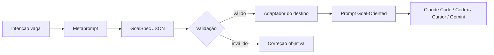

# Goal Metaprompter

Framework reutilizável para transformar uma intenção vaga em um prompt **Goal-Oriented**, verificável e adaptado para Claude Code, Codex, Cursor ou Gemini.

O projeto separa duas responsabilidades que costumam ficar misturadas:

1. **Normalização semântica:** uma LLM metaprompter converte a solicitação vaga em um `GoalSpec` JSON estável.
2. **Renderização determinística:** este pacote valida o `GoalSpec` e gera o prompt final no formato mais adequado ao agente de destino.

Essa separação torna o processo testável, versionável e apropriado tanto para uso manual quanto para pipelines de API.



## O contrato universal

Todo `GoalSpec` explicita cinco pilares:

- **Role:** especialidade necessária, sem persona ornamental.
- **Goal:** estado final observável, não uma lista rígida de microetapas.
- **Context & Inputs:** dados, caminhos, dependências e fontes de verdade.
- **Constraints:** limites reais, não uma coleção de proibições genéricas.
- **Output:** formato, seções, nível de detalhe e critérios de aceite.

O contrato também inclui critérios de sucesso, casos de borda, não objetivos, hipóteses, perguntas realmente bloqueantes e verificações finais.

## Uso direto

O template e o JSON Schema canônicos são recursos instaláveis do pacote, em [`src/goal_metaprompter/assets`](src/goal_metaprompter/assets). Gere o metaprompt pela CLI ou por `build_metaprompt`; para integrações que precisam do schema ou do template bruto, use `get_goal_spec_schema()` e `get_metaprompt_template()`.

Há um exemplo completo em [`examples/goal-spec.json`](examples/goal-spec.json).

## CLI

Instale localmente:

```powershell
python -m pip install -e .
```

Gerar o metaprompt a partir de argumentos:

```powershell
goal-metaprompter meta `
  --target codex `
  --prompt "Crie uma função de login" `
  --constraint "Não alterar o contrato HTTP existente" `
  --output-preference "Patch pronto para revisão, com testes" `
  --output meta-prompt.md
```

Ou usar um request JSON:

```powershell
goal-metaprompter meta --request examples/vague-request.json --output meta-prompt.md
```

Depois que a LLM metaprompter devolver o `GoalSpec`:

```powershell
goal-metaprompter validate examples/goal-spec.json
goal-metaprompter render examples/goal-spec.json --output prompt-final.md
```

Sem instalação, use `python -m goal_metaprompter` com `src` no `PYTHONPATH`.

## Integração por API

O pacote não acopla o fluxo a nenhum SDK. A aplicação envia o valor retornado por `build_metaprompt` à LLM disponível, exige uma resposta JSON compatível com o schema, valida e renderiza:

```python
import json

from goal_metaprompter import (
    GoalRequest,
    GoalSpec,
    Target,
    build_metaprompt,
    get_goal_spec_schema,
    render_goal_prompt,
    validate_spec,
)

request = GoalRequest(
    vague_prompt="Crie uma função de login",
    target=Target.CODEX,
    constraints=("Não alterar o contrato HTTP existente",),
    output_preference="Patch pronto para revisão, com testes",
)

meta_prompt = build_metaprompt(request)
schema = get_goal_spec_schema()

# Envie meta_prompt ao provedor e solicite JSON estruturado com `schema`.
provider_response = call_your_llm(meta_prompt)
spec = GoalSpec.from_dict(json.loads(provider_response))

report = validate_spec(spec)
report.raise_for_errors()
final_prompt = render_goal_prompt(spec)
```

Em produção, use o recurso nativo de **structured output / JSON Schema** do provedor quando disponível. Não extraia JSON de prosa com expressões regulares.

## Adaptação por destino

| Destino | Estrutura gerada | Ênfase |
| --- | --- | --- |
| Claude Code | XML descritivo | separação inequívoca entre contexto, tarefa, limites, ferramentas e validação |
| Codex | Markdown compacto | objetivo primeiro, contexto de workspace, mudanças delimitadas, testes e evidências |
| Cursor | Markdown compacto | regras do repositório, arquivos em escopo, contratos e validação no editor/agente |
| Gemini | Markdown hierárquico | contexto unificado, inventário multimodal, instruções críticas e saída estruturada |

O framework pede planejamento e autocorreção **internos**, mas não exige que o modelo exponha raciocínio privado. O resultado deve mostrar decisões, evidências, testes e limitações — não uma transcrição de chain-of-thought.

## Princípios de segurança e qualidade

- URLs devem ser absolutas (`https://...`). O metaprompter nunca inventa uma fonte; se ela não foi fornecida, registra a lacuna.
- Caminhos locais ficam no contexto e devem ser absolutos quando o executor precisar encontrá-los sem ambiguidade.
- Hipóteses reversíveis são declaradas. Decisões irreversíveis ou de alto impacto viram perguntas bloqueantes.
- Casos de borda são inferidos a partir do domínio, mas não substituem requisitos de negócio desconhecidos.
- Restrições precisam prevenir um risco real. Instruções redundantes, personas infladas e “anti-slop” subjetivo são removidos.
- O prompt final sempre termina com verificações observáveis contra os critérios de sucesso.

Detalhes de arquitetura e governança estão em [`docs/framework.md`](docs/framework.md).

## Fontes de referência

As decisões do framework seguem as orientações oficiais atuais:

- [OpenAI — Prompting](https://learn.chatgpt.com/docs/prompting.md): objetivo, contexto, saída, limites e verificação final.
- [Anthropic — Prompting best practices](https://platform.claude.com/docs/en/build-with-claude/prompt-engineering/claude-prompting-best-practices): clareza, papéis, exemplos e tags XML para prompts complexos.
- [Google — Prompt design strategies](https://ai.google.dev/gemini-api/docs/prompting-strategies): instruções específicas, contexto longo, exemplos consistentes e saída estruturada.
- [Cursor — Rules](https://docs.cursor.com/context/rules-for-ai): regras persistentes e contexto de projeto para o agente.

## Verificação local

```powershell
python -m unittest discover -s tests -v
ruff check .
mypy src
python -m build
```
